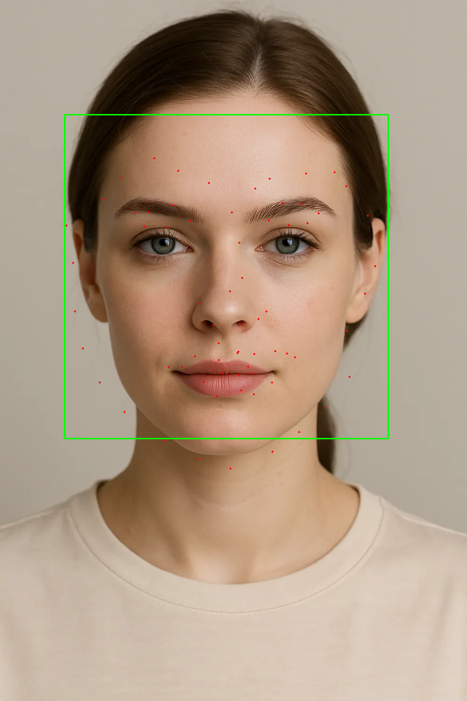
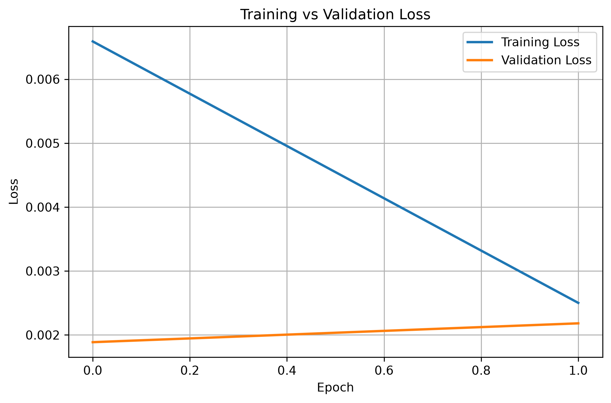

# Face Landmark Detection

A facial landmark detection system built using **PyTorch**, **ResNet18**, and **OpenCV**. The model predicts **68 facial landmarks** from a detected face and supports both image and webcam inference.

---

## Features

- 68 facial landmark prediction
- ResNet18-based regression model
- Image inference
- Webcam inference
- Automatic face detection using Haar Cascades
- Training and validation pipeline
- Model checkpointing
- Learning rate scheduling
- Accuracy evaluation (MSE & RMSE)
- Training loss visualization

---

## Tech Stack

- Python
- PyTorch
- Torchvision
- OpenCV
- NumPy
- Pillow
- Matplotlib
- tqdm

---

## Project Structure

```
Face-LandMark-Detection/
│
├── app/
│   ├── dataset.py
│   ├── transforms.py
│   ├── trainer.py
│   ├── train.py
│   ├── inference.py
│   ├── predict.py
│   ├── webcam.py
│   ├── face_detector.py
│   └── utils.py
│
├── configs/
│   └── train_config.py
│
├── models/
│   ├── resnet.py
│   └── checkpoints/
│
├── outputs/
│   ├── loss_curve.png
│   └── prediction.png
│
├── tests/
│
├── requirements.txt
├── README.md
└── .gitignore
```

---

## Dataset

- HELEN Dataset
- 300W Dataset

The dataset is **not included** in this repository due to its size.

---

## Installation

Clone the repository

```bash
git clone https://github.com/<your-username>/Face-LandMark-Detection.git

cd Face-LandMark-Detection
```

Create a virtual environment

```bash
python -m venv .venv
```

Activate it

Windows

```bash
.venv\Scripts\activate
```

Linux / macOS

```bash
source .venv/bin/activate
```

Install dependencies

```bash
pip install -r requirements.txt
```

---

## Training

```bash
python -m app.train
```

The best model checkpoint is saved in

```
models/checkpoints/
```

---

## Image Inference

Place an image inside

```
assets/
```

Run

```bash
python -m app.predict
```

Output

```
outputs/prediction.png
```

---

## Webcam Inference

```bash
python -m app.webcam
```

Press **Q** to quit.

---

## Evaluation

```bash
python -m tests.test_accuracy
```

Example output

```
Average MSE  : 0.000827
Average RMSE : 0.028759
```

---

## Results

### Prediction



---

### Training Loss



---

## Future Improvements

- Faster face detector (MediaPipe / RetinaFace)
- Mobile deployment
- ONNX export
- Real-time optimization
- Head pose estimation

---

## License

This project is intended for learning and educational purposes.